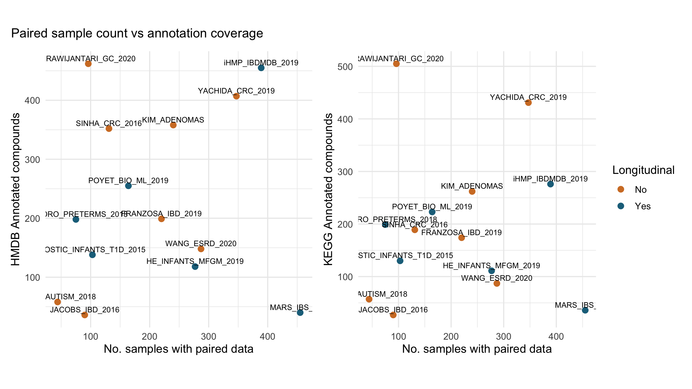

# **Data Visualization**
***

If you have been following along but stopped, we could load our wrangled data like so:

```{r, eval = FALSE}
load(here::here("data", "wrangled", "wrangled_data.rda"))
```

***
<details> <summary> If you skipped the data import section click here. </summary>

An RDA file (stands for R data) of the data can be found [here](https://github.com//opencasestudies/ocs-bp-co2-emissions/tree/master/data/wrangled) or slightly more directly [here](https://raw.githubusercontent.com/opencasestudies/ocs-bp-co2-emissions/master/data/wrangled/wrangled_data.rda). Download this file and then place it in your current working directory within a subdirectory called "wrangled" within a subdirectory called "data" to use the following code. We used an RStudio project and the [`here` package](https://github.com/jennybc/here_here) to navigate to the file more easily.


```{r, eval = FALSE}
load(here::here("data", "wrangled", "wrangled_data.rda"))
```

</details>
***

We'll use this section to make two scatter plots that are combined with `patchwork`, specifically using the modified container to run the code

  * labeling the points with the `dataset_name`
  * coloring the points based on `longitudinal` value
  * x-axis is either `hmdb_annotated_compounds` or `kegg_annotated_compounds`
  * y-axis is `num_paired_samples`


```{r, eval = FALSE}
library(patchwork)

hmdb_scatter + labs(title = NULL) +                                             #<1>
  kegg_scatter +  labs(title = NULL) +                                          #<2>
  plot_layout(guides = "collect") +                                             #<3>
  plot_annotation(title = 'Paired sample count vs annotation coverage')         #<4>
```

1. Use the HMDB scatter plot from before, but remove its title
2. Use the KEGG scatter plot from before, but remove its title
3. Combine the legends
4. Add a single title for the whole plot

{fig-alt="Two panel scatter plots showing the number of paired samples in each dataset versus the number of annotated compounds within that dataset. HMDB annotation on the left panel and KEGG annotation on the right panel. Datasets are colored by whether they are longitudinal or not."}

`patchwork` is a very useful package for combining plots. In this use case it isn't strictly necessary because we could use `pivot_longer` to wrangle the data and `facet_wrap` to split out the scatter plots for the different annotations. We chose to use `patchwork` in this case for illustrative purposes on adding a package to a container in an approachable example.

<!--
Add a click to expand details section about using `pivot_longer` and `facet_wrap` instead of patchwork?
-->

***
