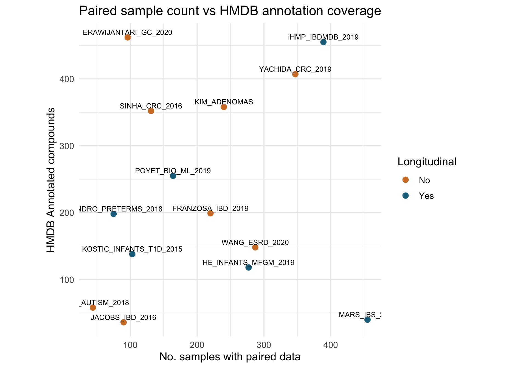
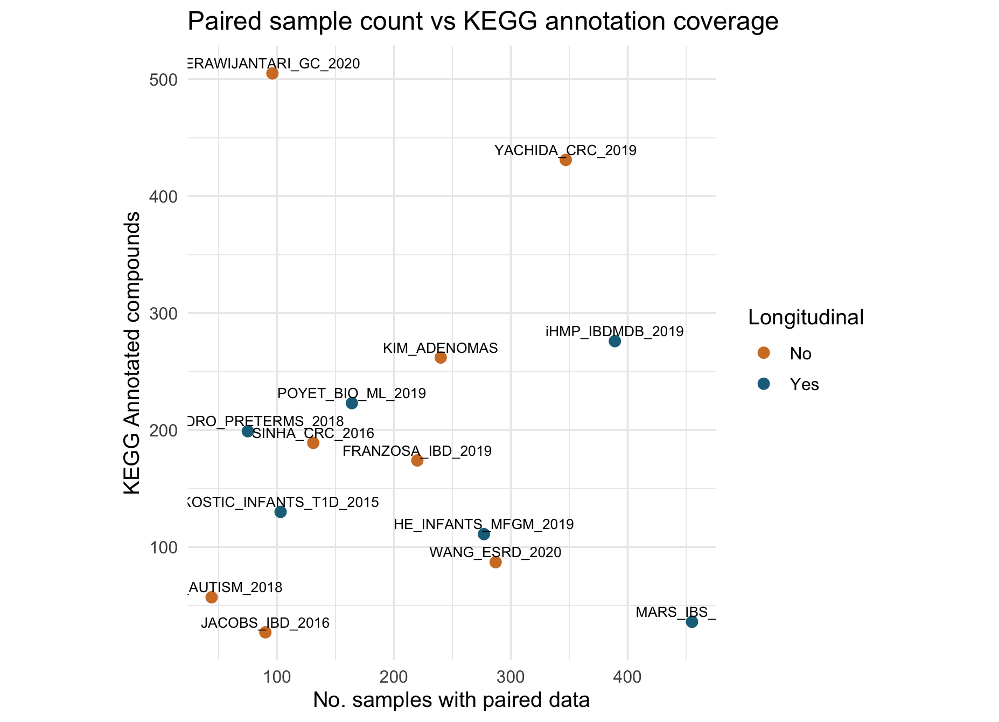
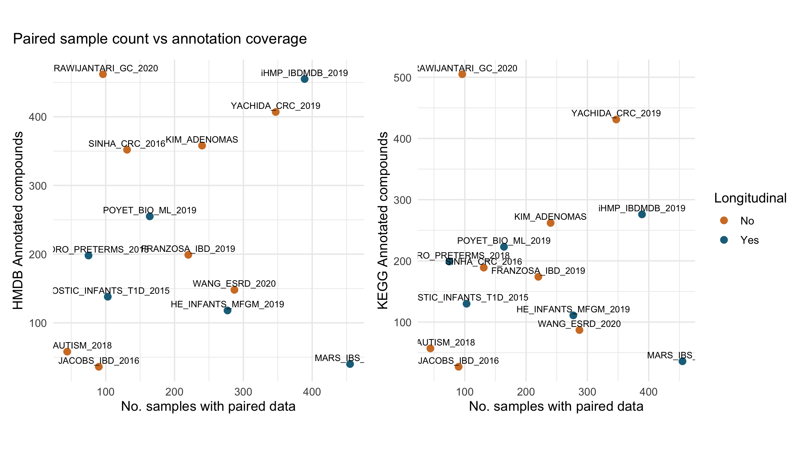

# **Data Visualization**
***

If you have been following along but stopped, the scripts we are using are set up to load our imported data like so within our analysis script within the running container (without having to run the original `extract_tables` code). Everyone is rerunning a new container at this section, so they should be good, just a reminder that the data should be there for them.

```{r, eval = FALSE}
load(here::here("data", "wrangled", "wrangled_data.rda"))
```

***

<details> <summary> If you skipped the data import section click here. </summary>

KI note: We'll need to add instructions to this about mounting or importing data if someone wants to pick up at this section. I don't think the container has `wget`, but I could set up a download that would have the file that they could then mount. Will do that and include instructions here for that.

</details>
***

## Container Infrastructure

::: {.panel-tabset}

### Docker Desktop

Build the modified dockerfile --> Image

Run the Image (while mounting the volume) -- > Container

### Docker through a CLI

Build the modified dockerfile --> Image

Run the Image (while mounting the volume) -- > Container

:::

Include a thought question to give learners the opportunity to build a flowchart (e.g., moving nouns and verbs into blanks) that represents the containerization process.

## Container Application

We'll use this section to make two scatter plots. And then combine the plots with `patchwork`, specifically using the modified container to run the code


### Docker Desktop

In the running container, run the visualization script(s)

Look at the output

### Docker through a CLI

In the running container, run the visualization script(s)

Look at the output

:::


```{.R filename="03a_visualization.R"}

```


{fig-alt="Scatter plot showing the number of paired samples in each dataset versus the number of HMDB annotated compounds within that dataset. Datasets are colored by whether they are longitudinal or not." width=800 .lightbox}


{fig-alt="Scatter plot showing the number of paired samples in each dataset versus the number of KEGG annotated compounds within that dataset. Datasets are colored by whether they are longitudinal or not." width=800 .lightbox}

We can use `ls plots/` to see that these png files exist. Though we'll have to use the file explorer to save any of those files to our system. Is there an easy way besides basing an image off of an IDE like VSCode or RStudio?


```{.R filename="03b_visualization.R"}

```

1. Use the HMDB scatter plot from before, but remove its title
2. Use the KEGG scatter plot from before, but remove its title
3. Combine the legends
4. Add a single title for the whole plot

We can again use `ls plots/` to see the new png file that was saved. The logs should also say something about saving the file

{fig-alt="Two panel scatter plots showing the number of paired samples in each dataset versus the number of annotated compounds within that dataset. HMDB annotation on the left panel and KEGG annotation on the right panel. Datasets are colored by whether they are longitudinal or not."}

`patchwork` is a very useful package for combining plots. In this use case it isn't strictly necessary because we could use `pivot_longer` to wrangle the data and `facet_wrap` to split out the scatter plots for the different annotations. We chose to use `patchwork` in this case for illustrative purposes on adding a package to a container in an approachable example.

Add a click to expand details section about using `pivot_longer` and `facet_wrap` instead of `patchwork`

Note that comparing plots can be pretty difficult and for someone who needs to validate the process, it's going to be easier if there's a summary stat. So what sort of summary stat should we add to the analysis?


***
