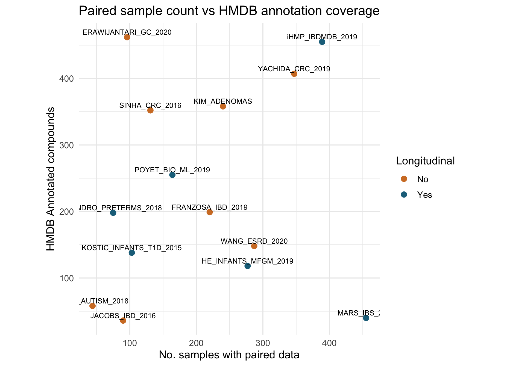
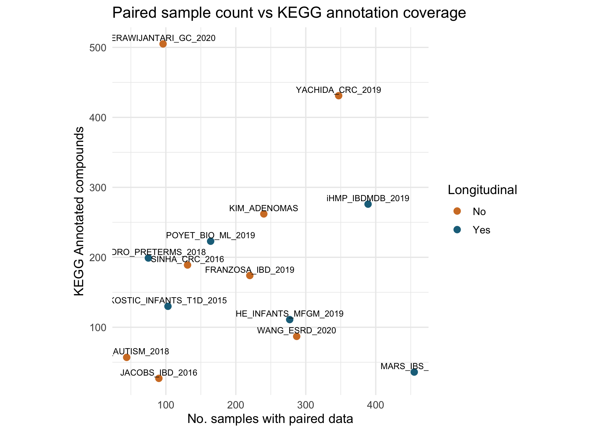

# **Data Wrangling**
***

## Data analysis data

If you have been following along but stopped, we could load our imported data like so within our analysis script within the running container (without having to run the original `extract_tables` code):

```{r, eval = FALSE}
load(here::here("data", "imported", "raw_table1.rda"))
```
***

KI note: I know this section is typically included in case studies, but if we're not storing data in a container, I'm not sure this is feasible and I think we need to remove this.

<details> <summary> If you skipped the data import section click here. </summary>

An RDA version (stands for R data) of the data can be found [here](https://github.com//opencasestudies/ocs-bp-co2-emissions/tree/master/data/imported) or slightly more directly [here](https://raw.githubusercontent.com/opencasestudies/ocs-bp-co2-emissions/master/data/imported/co2_data_imported.rda). Download this file and then place it in your current working directory within a subdirectory called "imported" within a directory called "data" to use the following code. We used an RStudio project and the [`here` package](https://github.com/jennybc/here_here) to navigate to the file more easily.

```{r, eval=FALSE}
load(here::here("data", "imported", "raw_table1.rda"))
```

</details>
***

We'll need to add this code to our `analysis.R` file using the same steps as before:

* navigate to the files tab
* right click on the `analysis.R` script and click edit
* copy paste the following code into the script
* click save
* navigate to the exec tab
* use `Rscript analysis.R` -- adjusting based on script location and learner's file location.

```{r, eval = FALSE}

table1_extract <- raw_table %>%
    mutate(num_paired_samples = as.numeric(str_extract(X3,                       #<1>
                                                      "\\d+$"))) %>%             #<1>
    mutate(X3Text = str_remove(X3,                                               #<2>
                               "\\d+$")) %>%                                     #<2>
    mutate(cohort_description = if_else(lead(is.na(X1), FALSE),                  #<3>
                                        paste0(X3Text,                           #<4>
                                              lead(X3Text)),                     #<4>
                                        X3Text)                                  #<5>
           ) %>%
    filter(!is.na(X1)) %>%                                                       #<6>
    select(!c(X3, X4, X3Text)) %>%                                               #<7>
    rename(c("dataset_name" = "X1",                                              #<8>
             "ref" = "X2",                                                       #<8>
             "longitudinal" = "X5",                                              #<8>
             "hmdb_annotated_compounds" = "X6",                                  #<8>
             "kegg_annotated_compounds" = "X7"))                                 #<8>

```

1. Extracting the numbers (which represent the number of paired samples) at the end of the row to put them in their own column
2. Making a version of the text column that has those numbers of paired samples removed
3. Setting up an if else that evaluates whether the next value/row in the dataset name column is an NA value. This utilizes the `lead` function to look for the next value. In the case of the last row, we're using the `default` argument to pad the data with a `FALSE`
4. If the `lead` function returns that the next value is NA (`TRUE`), it will paste the current cohort text with the next row's text
5. Otherwise if the `lead` function returns that the next value is not NA (`FALSE`) (or is the last value/row), it will return the current cohort text only.
6. This filters to remove the rows where the dataset name is NA because we've already appended the important information from those rows
7. This removes the original X3 column (that had the cohort description plus number of paired samples), the X4 column which was all NAs, and the X3Text column which has incomplete cohort descriptions
8. Rename the columns so they are descriptive

<!--
Can include instructions in a dropdown section on how to wrangle the data if there's more than one NA row that needs to be collapsed
-->

To allow users to skip import and wrangling we will save the data as an RDA file as well as a CSV file as this is often useful to send our data to collaborators. We will save this in a “wrangled” subdirectory of our “data” directory of our working directory.

```{r, eval = FALSE}
save(table1_extract, file = here::here("data", "wrangled",       # <1>
                                       "wrangled_data.rda"))     # <1>
readr::write_csv(table1_extract,                                 # <2>
                 file = here::here("data","wrangled",            # <2>
                                   "wrangled_data.csv"))         # <2>
```

1. saving the data as an RDA file within the wrangled data subdirectory
2. saving the data as a CSV file within the wrangled data subdirectory


Now that we've wrangled the extracted table data into a dataframe, we can make the visualization!

Add the following code from the code blocks to the running container as well, repeating the steps

* navigate to the files tab
* right click on the `analysis.R` script and click edit
* copy paste the following code into the script
* click save
* navigate to the exec tab
* use `Rscript analysis.R` -- adjusting based on script location and learner's file location.


```{r, eval = FALSE}
hmdb_scatter <- table1_extract %>%
  mutate(longitudinal = factor(longitudinal, levels = c("No", "Yes"))) %>%
  ggplot(aes(x = num_paired_samples,
             y = hmdb_annotated_compounds,
             color = longitudinal,
             label = dataset_name)) +
  geom_point(size = 2.5) +
  geom_text(vjust = -0.5, size = 2.8, color = "black") +
  scale_color_manual(values = c("No" = "#D27D2D",
                                "Yes" = "#1D6F8A"), drop = FALSE) +
  labs(title = "Paired sample count vs HMDB annotation coverage",
       x = "No. samples with paired data",
       y = "HMDB Annotated compounds",
       color = "Longitudinal")  +
  theme_minimal(base_size = 12) +
  coord_fixed(ratio = 1)
```

{fig-alt="Scatter plot showing the number of paired samples in each dataset versus the number of HMDB annotated compounds within that dataset. Datasets are colored by whether they are longitudinal or not." width=800 .lightbox}


```{r, eval = FALSE}
kegg_scatter <- table1_extract %>%
  mutate(longitudinal = factor(longitudinal, levels = c("No", "Yes"))) %>%
  ggplot(aes(x = num_paired_samples,
             y = kegg_annotated_compounds,
             color = longitudinal,
             label = dataset_name)) +
  geom_point(size = 2.5) +
  geom_text(vjust = -0.5, size = 2.8, color = "black") +
  scale_color_manual(values = c("No" = "#D27D2D",
                                "Yes" = "#1D6F8A"), drop = FALSE) +
  labs(title = "Paired sample count vs KEGG annotation coverage",
       x = "No. samples with paired data",
       y = "KEGG Annotated compounds",
       color = "Longitudinal")  +
  theme_minimal(base_size = 12) +
  coord_fixed(ratio = 1)
```

{fig-alt="Scatter plot showing the number of paired samples in each dataset versus the number of KEGG annotated compounds within that dataset. Datasets are colored by whether they are longitudinal or not." width=800 .lightbox}


## Container

As you can see from the visualization step above, these two panels are completely separate separate plots -- and we'd like them to be visible next to each other.... we can use patchwork for that, but we'll need to add patchwork to our visualization container....

Activity: Add `patchwork` to the container

* edit the Dockerfile (in your favorite text editor)
* build the Dockerfile to be an image (will need to do this on terminal)

***
