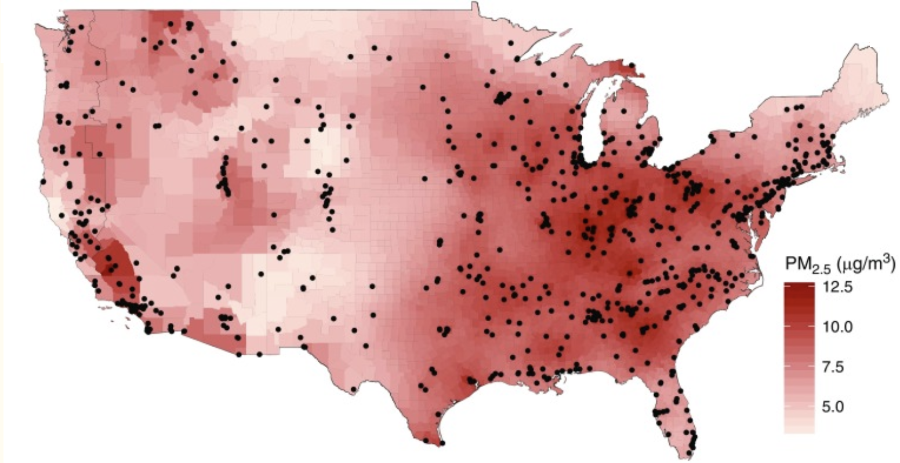

#### {.outline }

<!--
Replace the `img/mainplot.png` image with the appropriate case study image or consider using ottrpal::include_slide() with a publicly viewable slide deck as needed.
See image here for example: https://www.opencasestudies.org/ocs-bp-school-shootings-dashboard/

{fig-alt="Map showing amount of pollution across the US localized to monitors." width=800 .lightbox}
-->

```{r echo=FALSE, warning = FALSE, out.width=800}
ottrpal::include_slide("https://docs.google.com/presentation/d/1EFnuBBFlqjod7S1OlOoj_9-29nPO3ZhL6iJ-Pf8xzpg/edit?slide=id.g3dc0981b1da_0_1#slide=id.g3dc0981b1da_0_1")
```

####
