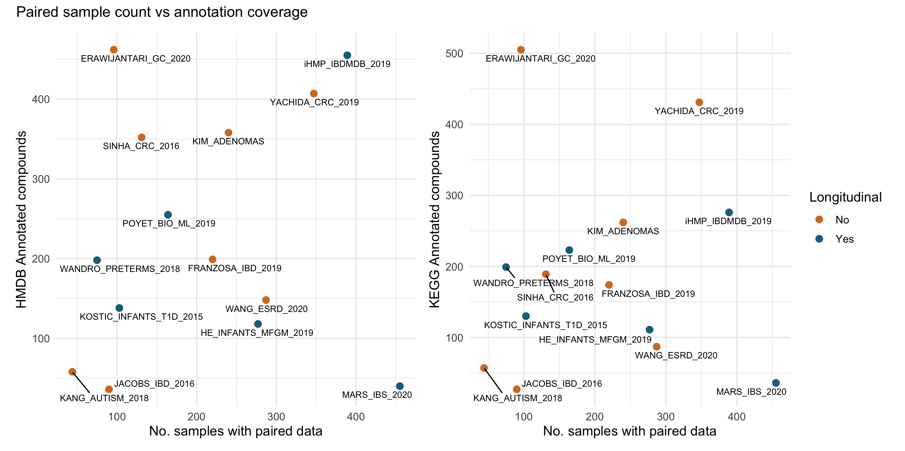

# **Suggested Homework**
***

<!--
Suggest extra exercises using this data for students to practice the skills used in the case study.
Example from a previous case study: https://www.opencasestudies.org/ocs-bp-co2-emissions/#Suggested_Homework
-->

Point out that text labels are overlapping each other in the right panel, and clipped on axis limits for both panels. The ggrepel package can be useful in fixing these problems.

  * Add ggrepel to the Dockerfile
  * build the Dockerfile
  * run the image
  * update the analysis.R script to utilize ggrepel within the scatter plots made with patchwork
  * and rerun the analysis with the modified container

{fig-alt="Two panel scatter plots showing the number of paired samples in each dataset versus the number of annotated compounds within that dataset. HMDB annotation on the left panel and KEGG annotation on the right panel. Datasets are colored by whether they are longitudinal or not. Labels are clearer and not clipped."}

More advanced homework: Use a container together with GitHub actions to extract the PDF data and make the visualization.

***
