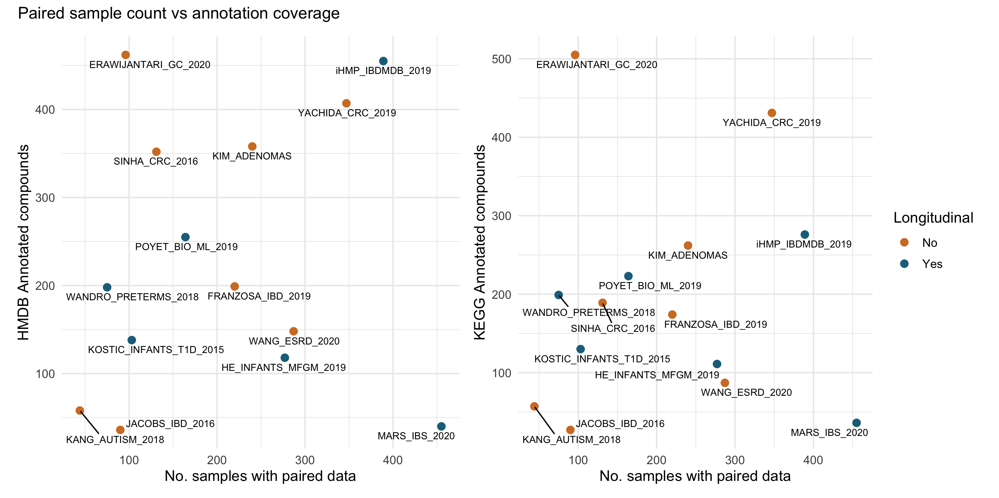

# **Continued Learning**
***

:::{.next_steps_box}
::::{.next_steps_box_header}
Common Next Steps
::::
::::{.inner_block}
Discuss common next steps for this type of an analysis in this box. Is there a specific number of steps that you need to do before a specific step? Is a "next step" more of an alternate step?
::::
:::

## Reinforcement Exercises

Point out that text labels are overlapping each other in the right panel, and clipped on axis limits for both panels. The ggrepel package can be useful in fixing these problems.

* Add `ggrepel` to the Dockerfile
  * build the Dockerfile
  * run the image
  * extract and wrangle the data with the `preprocessing.R` script or mount the wrangled data when running the image
  * update the `analysis.R` script to utilize `ggrepel` within the scatter plots made with `patchwork`
  * and rerun the analysis with the modified container
  * 
  
{fig-alt="Two panel scatter plots showing the number of paired samples in each dataset versus the number of annotated compounds within that dataset. HMDB annotation on the left panel and KEGG annotation on the right panel. Datasets are colored by whether they are longitudinal or not. Labels are clearer and not clipped."}
  


## Advancement Exercises

Use this section to suggest different levels of exercises that build upon topics from the case study ... next steps, tangential skills, diving deeper into a side quest, etc.

Perhaps explain how the suggested exercises relate to the common next steps.

### Beginner

Point out that the scatter plot lends itself to a linear regression because it seems generally that an increase in the number of paired samples leads to an increase in the number of observed compounds.

However, note that the outcome variable (number of annotated compounds observed) is a truncated variable because resources with 0 compounds are likely not going to be included. So performing a truncated linear regression may be more appropriate than a regular linear regression.

Edit the Dockerfile to install R `plotly` and `htmlwidgets` packages from github (using Pak)

* https://github.com/plotly/plotly.R
* https://github.com/ramnathv/htmlwidgets

Have them add a script to the `run_analysis.sh` script that runs plotly to create an interactive graph that highlights points.

```{r, eval = FALSE}
library(plotly)
library(htmlwidgets)
library(here)
library(tidyverse)

load(here("data", "wrangled", "wrangled_data.rda"))
table1_extract <- table1_extract %>%
    mutate(longitudinal = case_when(longitudinal == "Yes" ~ "Longitudinal", 
                                    longitudinal == "No" ~ "Not longitudinal", 
                                    TRUE ~ "Unknown"))

hover_text_template <- paste(
    "<b>Dataset:</b> %{text}<br>",
    "<b>Description:</b> %{customdata}",
    "<extra></extra>"
)

plotly_plot_hmdb <- table1_extract %>%
    plotly::plot_ly(
        x = ~num_paired_samples, 
        y = ~hmdb_annotated_compounds,
        color = ~longitudinal,
        text = ~dataset_name,                 # Point label text
        customdata = ~cohort_description,     # Hover description storage
        legendgroup = ~longitudinal, 
        showlegend = FALSE,
        type = 'scatter', 
        mode = "markers+text", 
        textposition = "top center",
        hovertemplate = hover_text_template   # Set hover text
    ) %>% 
    plotly::layout(
        title = 'Paired sample count vs HMDB annotation coverage', 
        xaxis = list(title = 'No. samples with paired data'), 
        yaxis = list(title = 'HMDB Annotated compounds')
    )

plotly_plot_kegg <- table1_extract %>%
    plotly::plot_ly(
        x = ~num_paired_samples, 
        y = ~kegg_annotated_compounds,
        color = ~longitudinal,
        text = ~dataset_name,
        customdata = ~cohort_description,
        legendgroup = ~longitudinal, 
        showlegend = TRUE,
        type = 'scatter', 
        mode = "markers+text", 
        textposition = "top center",
        hovertemplate = hover_text_template
    ) %>% 
    plotly::layout(
        title = 'Paired sample count vs KEGG annotation coverage', 
        xaxis = list(title = 'No. samples with paired data'), 
        yaxis = list(title = 'KEGG Annotated compounds')
    )

combined_plot <- subplot(style(plotly_plot_hmdb, showlegend = F), 
        plotly_plot_kegg) %>% 
    highlight(on = "plotly_hover", 
              off = "plotly_doubleclick", 
              persistent = FALSE, 
              dynamic = FALSE) %>% 
    layout(title = "Paired sample count vs annotation coverage")

output_dir <- here::here("results", "plots")

if (!dir.exists(output_dir)) {
  dir.create(output_dir, recursive = TRUE)
}

saveWidget(combined_plot, 
           file = here(output_dir, "interactive_combined_plot.html"), 
           selfcontained = TRUE)
```


Point them to the ITN courses for templates/recipes on adding packages to a Dockerfile.

### Intermediate

Create a Dockerfile from scratch which could be used to perform a similar analysis with Python. 

  * https://pypi.org/project/tabula-py/
  * pandas
  * matplotlib
  * https://github.com/ponnhide/patchworklib
  * https://github.com/Phlya/adjustText
  * https://pypi.org/project/pytruncreg/

Add in an AI box to note that AI can often be helpful in refactoring code if they wanted to test out the process.

Alternatively, find an image on Docker Hub that would meet their needs.

Point them to the ITN capstone course if they wanted to develop a Dockerfile for their own research needs.

### Advanced

Use a container together with GitHub actions to extract the PDF data and make the visualization.

Again point them to the ITN capstone course if they wanted to develop this for their own research needs.

***
